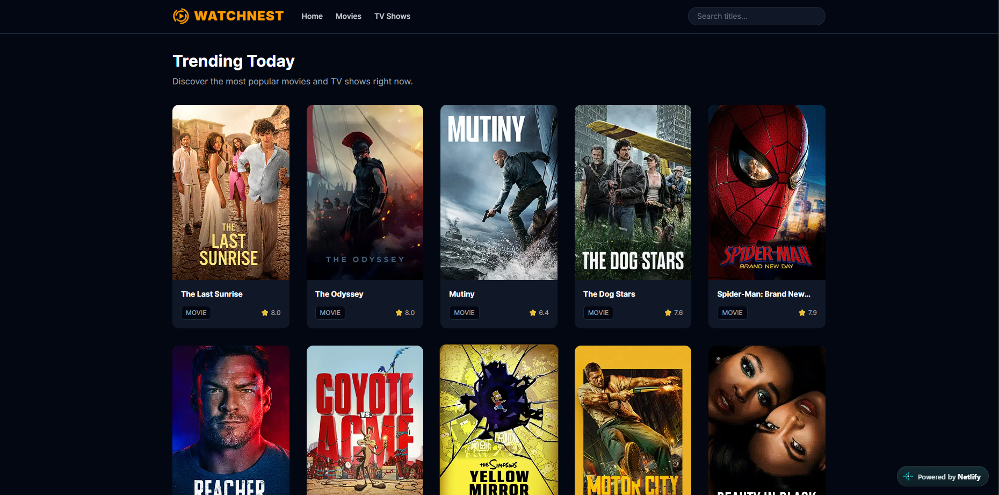

# Watchnest

[](https://watchnest-a.netlify.app)



A full-stack media tracking web application built to discover and track movies. Powered by the TMDB API.

## Tech Stack

- **Framework:** Next.js (App Router)
- **Language:** TypeScript
- **Styling:** Tailwind CSS
- **Data Provider:** TMDB (The Movie Database) API
- **Deployment:** Netlify

## Getting Started

1. Clone the repository:
   ```bash
   git clone [https://github.com/arbaaz-77/watchnest-next.git](https://github.com/arbaaz-77/watchnest-next.git)
   ```
